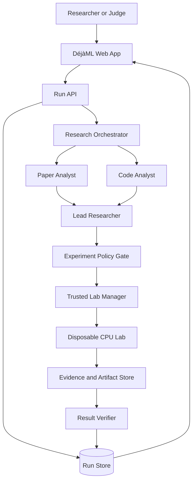

# DéjàML Architecture

**Working tagline:** Same claim. One more run.

**Document status:** Initial architecture baseline  
**Target:** Overnight hackathon demo  
**Primary case:** Urban Land Cover Random Forest result  
**Scope:** One bounded claim, one public paper, one public repository, one CPU experiment

## 1. Purpose

DéjàML turns one lightweight machine-learning paper into an inspectable reproduction attempt. A user uploads a text-readable PDF. The system finds the public repository cited by the paper, identifies one numeric experimental claim, maps that claim to repository code, runs one bounded CPU experiment in a disposable lab, and compares the observed metric with the published value.

DéjàML is not a paper summarizer and does not claim to prove or disprove an entire paper. Its output is a traceable answer to a narrower question:

> For this paper, repository revision, dataset, configuration, and execution environment, what did we run and how did its result compare with one published claim?

## 2. Demo promise

The overnight demo supports a curated, pretested paper/repository pair. Unknown papers may be analyzed, but execution is allowed only when the system can produce a valid experiment plan within the supported policy. Unsupported cases end as `Inconclusive` rather than inventing commands, metrics, or conclusions.

The critical end-to-end path is:

1. Upload the paper PDF.
2. Extract paper text with page anchors.
3. Discover the repository URL contained in the paper.
4. Run paper and repository analysis concurrently.
5. Reconcile both analyses into one experiment plan.
6. Validate the plan against deterministic policy.
7. Execute the experiment in a disposable CPU lab.
8. Parse one numeric metric from actual output.
9. Compare the observed metric with the paper value.
10. Preserve evidence and destroy the lab.

## 3. Product-facing roles

The user interface presents research roles rather than implementation-framework names.

### 3.1 Paper Analyst

**Purpose:** Extract one testable paper claim and find the associated repository.

**Inputs:**

- PDF text grouped by page
- paper metadata
- approved extraction schema

**Outputs:**

- candidate repository URLs with page evidence
- selected experiment label
- dataset and split
- model or method
- metric name, unit, and reported value
- preprocessing, seed, and parameter statements
- missing fields and uncertainty

**Allowed capabilities:** Read and search the uploaded paper; record structured observations.

**Prohibited capabilities:** Shell execution, repository access, lab access, network browsing beyond validated links.

### 3.2 Code Analyst

**Purpose:** Map the paper claim to repository files and a candidate entry point.

**Inputs:**

- shallow-cloned repository at a pinned commit
- paper claim summary
- repository inspection policy

**Outputs:**

- relevant README sections
- dependency manifests
- notebooks, scripts, and configuration paths
- dataset references
- candidate argv-style commands
- metric output locations
- claim-to-code mapping rationale
- reproducibility warnings

**Allowed capabilities:** Read-only repository listing, search, and file reads.

**Prohibited capabilities:** Host shell execution, package installation, file mutation, lab creation.

### 3.3 Lead Researcher

**Purpose:** Reconcile paper and code evidence into exactly one bounded experiment.

**Inputs:** Paper Analyst output, Code Analyst output, case manifest, run budget.

**Outputs:** A validated candidate `ExperimentPlan`, or an `Inconclusive` decision with evidence.

**Stop conditions:**

- paper metric and code metric are not comparable;
- dataset or evaluation split cannot be identified;
- repository URL is ambiguous;
- the experiment requires a GPU or exceeds the CPU budget;
- required data is unavailable or restricted;
- no defensible entry point exists.

### 3.4 Lab Engineer

**Purpose:** Prepare and execute the approved experiment inside an isolated environment.

**Inputs:** Validated `ExperimentPlan` and immutable input artifacts.

**Outputs:**

- lab specification and image digest
- preparation actions
- exact execution command
- timestamps, duration, and exit code
- bounded stdout/stderr
- exported artifact hashes
- cleanup receipt

The Lab Engineer cannot access host credentials, the host shell, or the Docker socket. It communicates only through typed Lab Manager operations.

### 3.5 Result Verifier

**Purpose:** Extract the actual metric and compare it with the paper claim.

**Inputs:** Paper claim, experiment plan, logs, exported metric artifact, attempt metadata.

**Outputs:**

- paper and observed values
- unit-normalized values
- signed and absolute differences
- comparability checks
- verdict
- discrepancy hypotheses clearly labelled as hypotheses
- evidence pointers

## 4. System context



## 5. Trust boundaries

### 5.1 Trusted control plane

The web backend, orchestrator, policy gate, run store, and Lab Manager are trusted application components. They may handle provider credentials and Docker control, but they must never project those privileges into the experiment environment.

### 5.2 Untrusted inputs

Treat all of the following as untrusted:

- uploaded PDFs;
- extracted paper text;
- repository URLs;
- Git repositories and commit contents;
- ZIP archives if added later;
- dependency metadata;
- model-generated commands and conclusions;
- experiment output and exported artifacts.

### 5.3 Disposable execution plane

Repository code executes only in a disposable lab with:

- non-root user;
- dropped Linux capabilities;
- `no-new-privileges`;
- no Docker socket;
- no host home-directory mount;
- bounded CPU, memory, process count, disk, and wall time;
- explicit writable workspace and artifact paths;
- preparation networking limited by policy;
- no network during the experiment when feasible;
- guaranteed cleanup after success, failure, cancellation, or timeout.

A code-review agent or skill may flag suspicious behavior but is not a security boundary. Isolation is mandatory even after a clean review.

## 6. Major components

### 6.1 Web application

Responsibilities:

- paper upload and validation;
- run creation;
- research-role status cards;
- evidence-bearing event timeline;
- lab output display;
- cancellation;
- findings and report download.

The overnight demo has four product states:

1. **New Study**
2. **Research Team**
3. **Virtual Lab**
4. **Findings**

### 6.2 Run API

Initial endpoints:

| Method | Endpoint | Purpose |
| --- | --- | --- |
| `POST` | `/api/runs` | Validate input and create a run |
| `GET` | `/api/runs/:runId` | Fetch the current run snapshot |
| `GET` | `/api/runs/:runId/events` | Stream ordered public events with SSE |
| `POST` | `/api/runs/:runId/cancel` | Request cancellation |
| `GET` | `/api/runs/:runId/report` | Download the JSON or HTML report |

### 6.3 Paper ingestion

The demo accepts a text-readable PDF. It records:

- original filename and size;
- SHA-256 digest;
- extracted text grouped by page;
- extraction warnings;
- repository URL candidates.

OCR is excluded from the overnight build.

### 6.4 Repository acquisition

Repository acquisition is performed by a trusted backend service rather than by an analyst agent.

Initial policy:

- HTTPS GitHub URLs only;
- public repositories only;
- shallow clone;
- no submodules;
- bounded clone time and size;
- pin and record the resolved commit SHA;
- reject local, loopback, private-network, SSH, and `file://` targets;
- keep the acquired repository read-only for analysis.

### 6.5 Research orchestrator

The orchestrator launches Paper Analyst and Code Analyst as independent sessions after the repository is acquired. Their outputs are stored as validated structured records. The Lead Researcher begins only after both records are terminal.

The orchestration implementation may use OpenClaw internally, but product events expose research roles and evidence—not framework-specific terminology or private reasoning traces.

### 6.6 Experiment policy gate

The policy gate is deterministic. It validates the model-produced plan and never asks a model whether its own command is safe.

Checks include:

- repository and commit match the acquired input;
- dataset source matches an approved source;
- working directory remains inside the lab workspace;
- command is represented as executable plus argument array;
- executable is permitted by the case policy;
- no shell control operators or host paths;
- environment variables are allowlisted;
- time and resource budgets are within server limits;
- metric extraction rule is bounded;
- preparation steps are recorded separately from execution.

### 6.7 Lab Manager

Only the Lab Manager talks to the container runtime. It exposes narrow operations:

- `createLab(spec)`
- `prepareLab(labId, steps)`
- `executeAttempt(labId, command)`
- `readArtifact(labId, path)`
- `cancelLab(labId)`
- `destroyLab(labId)`

All operations emit append-only events. Cleanup runs in a `finally` path and produces an explicit receipt.

### 6.8 Evidence and report service

The report contains:

- hashes and source identifiers;
- paper claim with page evidence;
- repository commit and relevant file paths;
- experiment plan;
- lab image and resource policy;
- preparation changes;
- exact argv-style command;
- attempt logs, exit code, and duration;
- metric extraction source;
- paper value, observed value, delta, tolerance, and verdict;
- limitations and unresolved discrepancies;
- cleanup outcome.

## 7. Core contracts

### 7.1 Claim

```ts
type Claim = {
  experimentLabel: string;
  dataset: string;
  split: string | null;
  model: string;
  metric: {
    name: string;
    unit: "fraction" | "percent" | "score";
    reportedValue: number;
  };
  seed: number | null;
  hyperparameters: Record<string, string | number | boolean>;
  evidence: Array<{
    page: number;
    excerpt: string;
  }>;
  missingFields: string[];
  confidence: "high" | "medium" | "low";
};
```

### 7.2 Code mapping

```ts
type CodeMapping = {
  repositoryUrl: string;
  commitSha: string;
  entrypoint: string;
  relevantFiles: Array<{
    path: string;
    sha256: string;
    reason: string;
  }>;
  dependencyFiles: string[];
  datasetReferences: string[];
  candidateCommand: {
    executable: string;
    args: string[];
    cwd: string;
  } | null;
  metricEvidence: string[];
  warnings: string[];
};
```

### 7.3 Experiment plan

```ts
type ExperimentPlan = {
  caseId: string;
  repository: {
    url: string;
    commitSha: string;
  };
  claim: Claim;
  dataset: {
    name: string;
    sourceUrl: string;
    sha256: string | null;
    expectedPaths: string[];
  };
  preparation: Array<{
    kind: "copy" | "rename" | "install" | "generate";
    description: string;
    command?: { executable: string; args: string[] };
  }>;
  command: {
    executable: string;
    args: string[];
    cwd: string;
    env: Record<string, string>;
  };
  resources: {
    cpus: number;
    memoryMb: number;
    pids: number;
    timeoutSeconds: number;
    networkDuringRun: false;
  };
  metricExtraction: {
    source: "stdout" | "json" | "csv";
    pattern?: string;
    path?: string;
    key?: string;
  };
  maxAttempts: 1 | 2;
  stopConditions: string[];
};
```

### 7.4 Public event

```ts
type RunEvent = {
  id: string;
  runId: string;
  sequence: number;
  timestamp: string;
  actor:
    | "system"
    | "paper_analyst"
    | "code_analyst"
    | "lead_researcher"
    | "lab_engineer"
    | "result_verifier";
  type: string;
  status: "started" | "progress" | "completed" | "warning" | "failed";
  summary: string;
  evidencePointers: string[];
  publicPayload: Record<string, unknown>;
};
```

Events contain public action summaries and tool results, never hidden chain-of-thought or provider secrets.

## 8. Run state machine

```text
Queued
  → Ingesting
  → Discovering Repository
  → Analyzing
  → Planning
  → Validating Plan
  → Preparing Lab
  → Running
  → Comparing
  → Completed
```

Terminal alternatives:

- `Inconclusive`
- `Failed`
- `Cancelled`
- `Timed Out`

Every terminal state must have a report and a lab-cleanup outcome.

## 9. Verdict rules

Supported verdicts:

- `Reproduced within tolerance`
- `Different result`
- `Inconclusive`

Before numeric comparison, the Result Verifier checks:

- same metric definition;
- same unit;
- same dataset;
- same split;
- compatible preprocessing;
- identified seed behavior;
- baseline and modified attempts are separated.

The demo tolerance may be configured per curated case. It is displayed as a product threshold, not a proof of statistical equivalence.

## 10. Initial curated case

### 10.1 Source

- **Paper:** *Tabular Deep Learning vs Classical Machine Learning for Urban Land Cover Classification*
- **Paper URL:** `https://arxiv.org/abs/2609.19010`
- **Repository:** `https://github.com/mtesha/tdl-vs-ml-urbanlandcover`
- **Dataset:** UCI Urban Land Cover, dataset 295
- **Claim:** Random Forest test accuracy of `81.66%`

### 10.2 Verified preliminary findings

- The paper directly contains the repository URL.
- The official data has 168 training rows, 507 test rows, 147 features, and 9 classes.
- The repository uses a small scikit-learn Random Forest experiment suitable for CPU execution.
- The repository expects filenames that differ from the official archive names; this must be recorded as a preparation change.
- The paper states fixed seeds, but the notebook uses an unspecified validation-split seed.
- Preliminary repeated runs produced materially different accuracies, so nondeterminism is a first-class finding rather than something to hide.

### 10.3 Demo behavior

DéjàML will use a documented deterministic seed for its attempt, show the paper's reported value and the observed value, and explain that the repository does not expose the seed used for the paper result. It must not search for a seed merely because that seed reproduces the published number.

## 11. Storage model

The overnight demo uses SQLite plus filesystem artifacts.

Minimum tables:

- `runs`
- `claims`
- `code_mappings`
- `experiment_plans`
- `attempts`
- `metrics`
- `events`
- `assessments`

Immutable inputs and exported artifacts are content-addressed by SHA-256. Secrets are stored only through server configuration and are never persisted in run records.

## 12. Proposed repository layout

```text
dejaml/
  apps/
    web/                       # User interface
    api/                       # Run API and orchestration
  packages/
    contracts/                 # Shared schemas and state model
    research-runtime/          # Role prompts, tools, orchestration adapters
  services/
    lab-manager/               # Trusted container boundary
  lab-images/
    python-cpu/                # Pinned CPU lab image
  cases/
    urban-land-cover/          # Curated manifest, parser, expected evidence
  fixtures/
    events/                    # Deterministic UI and integration fixtures
  docs/
    phases/                    # Phase plans and completion/recovery notes
    decisions/                 # Architecture decision records
    runbooks/                  # Setup, demo, failure recovery
  artifacts/                   # Gitignored local run artifacts
  ARCHITECTURE.md
  ROADMAP.md
  README.md
```

## 13. Failure handling

### Analysis failures

- Preserve completed analyst output.
- Mark missing or invalid output explicitly.
- Do not proceed to execution without a complete validated plan.

### Preparation failures

- Record the exact step, command, output, and exit code.
- Permit at most one bounded remediation in the final demo.
- Preserve baseline and modified attempts separately.

### Execution failures

- Terminate the process tree.
- export bounded logs;
- destroy the lab;
- mark the run `Failed`, `Timed Out`, or `Cancelled`;
- preserve a report explaining the failure.

### Service restart

On startup, the API scans non-terminal runs:

- runs with no active lab are marked interrupted and recoverable;
- orphan lab identifiers are sent to cleanup;
- append-only events are retained;
- a user may restart from the last safe boundary, but an interrupted experiment attempt is never silently continued as if uninterrupted.

## 14. Observability

Each event has a monotonic sequence number. The browser can reconnect with the last received sequence. Logs are bounded in the UI, while full bounded logs remain artifacts.

Required operational signals:

- run-state transitions;
- analyst duration and failure;
- policy rejection reason;
- container creation and destruction;
- command duration and exit status;
- metric extraction result;
- artifact size and digest;
- cancellation and timeout outcome.

## 15. Testing strategy

### Unit tests

- PDF link extraction;
- schema validation;
- URL and path policy;
- command policy;
- state transitions;
- metric normalization and comparison;
- report generation.

### Contract tests

- analyst output to Lead input;
- Lead plan to policy gate;
- Lab Manager events to API events;
- SSE fixture to frontend rendering.

### Integration tests

- curated case from prepared inputs to parsed metric;
- unsupported repository becomes `Inconclusive`;
- timeout terminates the process and destroys the lab;
- cancellation preserves evidence and destroys the lab;
- page refresh resumes the event stream.

### Demo acceptance test

The uploaded curated PDF must lead to:

1. the correct repository discovery;
2. the Random Forest claim with page evidence;
3. a pinned repository commit;
4. one real isolated CPU experiment;
5. a parsed test accuracy;
6. a paper-versus-observed comparison;
7. a visible seed discrepancy finding;
8. a successful cleanup receipt;
9. a downloadable report.

## 16. Overnight implementation order

1. Freeze contracts and the curated case manifest.
2. Prove a deterministic experiment script and metric parser.
3. Build the append-only run store and event fixture.
4. Implement PDF ingestion and repository discovery.
5. Implement analyst orchestration and plan validation.
6. Implement the Lab Manager and real isolated execution.
7. Implement the four-screen interface.
8. Connect the live event stream and reporting.
9. Verify cancellation, timeout, and cleanup.
10. Rehearse and freeze the demo.

## 17. Deferred work

The following are intentionally deferred:

- arbitrary paper support;
- OCR;
- private repositories;
- Git submodules and Git LFS;
- GPUs;
- multiple experiments per paper;
- parallel labs;
- broad automatic dependency repair;
- collaboration accounts;
- PDF report export;
- local large-model inference during the live demo;
- dynamically installed third-party skills.

## 18. Architecture principles

1. **Evidence before verdict.** Every claim, command, metric, and conclusion points to a source.
2. **Inconclusive is valid.** The system stops rather than fabricating missing connections.
3. **Plans are data.** Models propose structured plans; deterministic code validates them.
4. **Isolation over trust.** Repository review does not replace sandboxing.
5. **One real vertical slice.** Demo reliability matters more than superficial breadth.
6. **Restorable progress.** Every completed sub-phase includes a completion and recovery note.
7. **No hidden repair.** Every preparation change and retry is visible and immutable.
8. **Framework names stay technical.** Users see research roles and scientific evidence.
